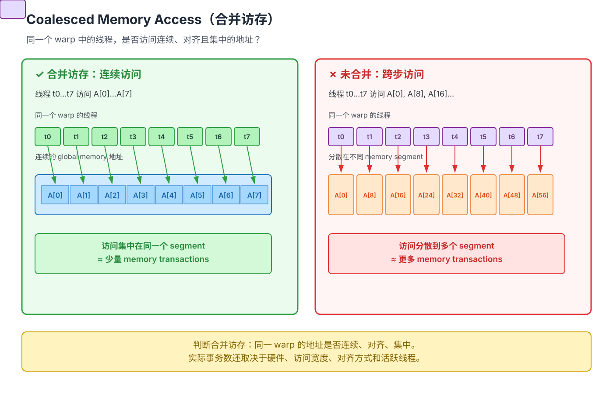

# 第 03 章 内存层次与数据搬运

> **本章目标**：回答三个问题：数据现在在哪里、谁能看到它、为什么要搬运或复用它。
> 在此基础上理解 shared、fragment、`T.copy` 和 tiling，并写出一个刻意保守的 softmax
> 数据流基线。第 05、06 章的优化都建立在本章的“位置—可见性—复用”模型上。

**学习信息**

- 难度：基础到中级；预计用时：3–4 小时；
- 前置：第 01～02 章，理解 tile 索引、边界和 `alloc_*`；
- 运行范围：内存模型通用，具体布局/归约结果以 CUDA 目标和 TileLang 版本为准；
- 本章产出：一张数据流图、一个正确但刻意保守的 softmax 基线，以及一份 memory-bound 假设记录。
- 参考：[Language Basics](https://github.com/tile-ai/tilelang/blob/main/docs/programming_guides/language_basics.md)、[CUDA Best Practices](https://docs.nvidia.com/cuda/cuda-c-best-practices-guide/)。

**阅读路线：**先用相对关系理解内存层次，不先背硬件常数；再从 GEMM 的一个输出 tile
推导数据复用；然后学习 `T.copy` 和手写搬运的边界；最后把这些概念放进 softmax，
用 profiler 验证“访存受限”只是一个假设，而不是结论。

## 3.1 GPU 内存层次（先建心智模型）

| 层次 | 相对位置 | 谁可见 | 主要用途 |
|---|---|---|---|
| 全局内存/HBM | 离计算单元最远、容量最大 | 所有线程 | 保存输入和最终输出 |
| L2 等缓存 | 位于全局内存与 SM 之间 | 多个 block 可受益 | 硬件自动缓存，程序不直接分配 |
| 共享内存 | 靠近 SM、容量较小 | block 内线程 | 显式 tile 中转和线程间交换 |
| 寄存器/fragment | 最靠近计算、容量最小 | 单个线程 | 累加器和线程私有的局部值 |

> 具体容量、延迟、bank 数量和可用指令随 GPU 架构变化。性能报告应使用目标 GPU 的
> 官方规格和 profiler 结果，而不是把某张卡的数字当作通用常数。

读任何一次数据访问，都先问三件事：

1. **位置**：它位于 global、shared、fragment 还是寄存器？
2. **可见性**：是整个 grid、一个 block，还是单个线程可见？
3. **复用**：搬进更近的作用域后，有多少计算会重复使用它？

Roofline 模型把“计算量/峰值算力”和“访存量/峰值带宽”放在同一个判断框架里，帮助
我们提出 memory-bound 或 compute-bound 的假设。它是起点，不是测量结果；最终仍要用
计时和 profiler 验证。

## 3.2 为什么需要分块（tiling）

以 GEMM `C[M,N] += A[M,K] @ B[K,N]` 为例，朴素写法每个输出元素都要读一整行 A 和
一列 B，全局访存量 O(M·N·K)。但 A 的一个元素其实被 N 个输出复用、B 的一个元素被
M 个输出复用。**把计算分块**（如每 block 算 128×128 的 C tile，K 维按 32 切）后，
每个块只需把 128×32 + 32×128 的数据搬进共享内存，就能反复使用——全局访存一下子
降低一个数量级。这解释了 GEMM 性能的核心来源，但不是全部：tile 形状、布局、流水线、寄存器压力、波次和库实现也会影响结果：

```
朴素:  每个输出读 O(K) 个全局值 → A/B 读取主项 O(MNK)
分块:  A/B 读取主项：每个 block 的每个 K-tile 读 O(BM·BK + BK·BN)
       → A/B 总读取 O(MNK · (BM·BK+BK·BN)/(BM·BN·BK))
       = O(MNK · (BM+BN)/(BM·BN))，K 维复用
```

最终 `C` 的写回还要增加 `O(M·N)`；当 `K` 较大时，它通常不是主导项。

### 把分块访存公式展开

下面假设 `M/N/K` 都能被 `BM/BN/BK` 整除；不能整除时，把除法换成
`ceildiv`，并额外处理边界 guard 或零填充。

以 `C[M, N] += A[M, K] @ B[K, N]` 为例：

1. **一个 tile 阶段读多少？**

   一个输出 block 负责 `C` 的 `BM × BN` 区域。固定一个 K-tile 后，需要搬运：

   ```text
   A_shared: BM × BK       → BM·BK 个元素
   B_shared: BK × BN       → BK·BN 个元素
   合计:                     BK·(BM + BN) 个元素
   ```

2. **一共有多少个 block 和 K 阶段？**

   ```text
   输出 block 数 = (M / BM) × (N / BN)
   每个 block 的 K 阶段数 = K / BK
   block-stage 总数 = (M / BM) × (N / BN) × (K / BK)
   ```

3. **相乘得到总的逻辑 global-memory 读取量：**

   ```text
   总读取
   = (M/BM) × (N/BN) × (K/BK) × (BM·BK + BK·BN)
   = (M·N·K) × (BM·BK + BK·BN) / (BM·BN·BK)
   = M·N·K × (BM + BN) / (BM·BN)
   = M·N·K × (1/BM + 1/BN)
   ```

   原公式中的 `/BK` 不能省略：每个 K-tile 虽然读 `BK` 列，但一共只执行 `K/BK`
   个阶段，二者正好约掉。`BK` 会影响流水线、缓存和边界开销，但在这个理想化的
   元素读取模型中不会单独出现在最后的主项里。

4. **K 维复用到底发生在哪里？**

   - `A_shared` 中的一个元素，会被当前输出 tile 的 `BN` 个列方向结果重复使用；
   - `B_shared` 中的一个元素，会被当前输出 tile 的 `BM` 个行方向结果重复使用；
   - 因此，不是每个 `C[i, j]` 都重新从 global memory 读取整行 A 和整列 B，而是先把
     一个 `BM×BK` 和一个 `BK×BN` tile 搬入片上内存，再在 block 内重复消费。

**数值例子：**取 `M=N=K=4096`、`BM=BN=128`、`BK=32`。

```text
每个 block-stage 读取 = 128×32 + 32×128 = 8,192 个元素
输出 block 数         = (4096/128)×(4096/128) = 32×32 = 1,024
每个 block 的 K 阶段数 = 4096/32 = 128
总 block-stage 数      = 1,024×128 = 131,072
总读取                = 8,192×131,072 = 1,073,741,824 个元素
```

朴素实现如果每个输出元素都独立读取 K 个 A 元素和 K 个 B 元素，约为
`2×M×N×K = 137,438,953,472` 个元素读取。这个例子中，分块后的逻辑读取量约少
`128×`；复杂度公式通常写成 `O(...)`，会隐藏 A/B 两路读取带来的常数 2。这里统计的是
逻辑 global-memory load，真实 HBM 流量还会受到 L2 命中、边界 tile、对齐和编译器实现影响。

先把这条数据流画出来：`global → shared → fragment → global`。第 05 章会把它变成
完整 GEMM；现在只需要理解每一次搬运分别解决什么问题。

## 3.3 TileLang 的三种作用域回顾

```python
A_shared = T.alloc_shared((BM, BK), 'float16')   # 共享内存：block 内共享
C_frag   = T.alloc_fragment((BM, BN), 'float32') # 寄存器片段：每线程一份
s        = T.alloc_var('int32')                  # 标量

# 参数张量（T.Tensor）位于全局内存，是唯一没有显式分配的对象
```

关键理解：**fragment 的"形状"是虚拟的**。你写 `(BM, BN)`，编译器通过**布局推断
（layout inference）**决定每个线程实际持有哪些元素。比如 MMA 片段里一个线程持有
16×8 块中的 4 个元素。这个机制让你写"tile 级"代码，而不用管线程内如何摆放——
代价是你要理解"布局"概念才能做高级优化（第 07 章）。

## 3.4 `T.copy`：规则 tile 的默认搬运原语

```python
# （1）全局 → 共享：把 A 的一个 tile 拷进共享内存，范围从 dst 推断
T.copy(A[by * BM, ko * BK], A_shared)

# （2）共享 → 寄存器片段：GEMM 内部也可以显式搬（多数情况直接喂给 T.gemm）
T.copy(A_shared, A_frag)

# （3）片段 → 全局：写回结果
T.copy(C_frag, C[by * BM, bx * BN])

# （4）片段之间的搬运/类型转换也常用（如 fp32 片段 → fp16 片段再喂 GEMM）
T.copy(acc_s, acc_s_cast)
```

规则要点：

- 左参数可以是 `Buffer`、`BufferRegion`（如 `A[i, j]` 起点的切片）或 buffer load；
- 范围**自动推断**，必要时广播（如 1D → 2D）；
- `T.copy` 对外语义**同步**：执行完即可消费 `dst`。编译器在内部可能降级成
  `ld.global` / `ldmatrix` / `cp.async`（自动补 commit/wait）/ TMA，但保证语义；
- 编译器会根据目标和布局尝试生成合并访问与向量化，但不要把它当作性能保证；
- `LegalizeSafeMemoryAccess` 可能插入边界 guard，**不会替你决定越界 tile 应该填什么值**。
  需要零填充时，必须显式写入 0、做 padding，或用有效元素逻辑。

对规则的矩形区域，优先使用 `T.copy`；对单个元素，直接赋值更容易读；对转置、掩码、
补零或自定义索引，使用 `T.Parallel` 配合逐元素赋值。第 02 章已经展示了这三种写法，
本章只关注它们在不同内存作用域之间的含义。

本章要点：**什么是 coalesced memory access？**——同一 warp 的线程访问的地址尽量处于
连续、对齐且集中的内存段内，从而减少 memory transactions；否则会取回许多无关数据，
浪费带宽。分块拷贝之所以快，正是因为按连续的行/列切分。

下面的图只画出 8 个线程来突出访问模式；真实 NVIDIA warp 通常包含 32 个 lane。图中
“少量/更多事务”是教学示意，实际事务数还取决于硬件、访问宽度、对齐方式和活跃线程：



需要编辑图形时，可打开对应的 [Excalidraw 源文件](coalesced-memory-access.excalidraw)。

## 3.5 手写循环拷贝：什么时候需要

`T.copy` 是高层原语；当你需要更细控制（如转置写入、掩码、自定义布局）时，可以
手写循环：

```python
# B 的行在全局里是离散的：逐元素拷贝并显式控制访问
for k, j in T.Parallel(BK, BN):
    B_shared[k, j] = B[ko * BK + k, bx * BN + j]
```

此时 `T.Parallel` 提供并行迭代空间，编译器可能结合线程配置和布局生成并行/向量化访问；
是否真的得到理想访存，仍需查看生成代码或 profiler。上面的示例假设 tile 边界已经处理，
非整除尺寸不能直接省略 guard 或零填充。

## 3.6 布局提示（预告，第 07 章详解）

布局推断通常是对的，但需要干预时：

```python
from tilelang.cuda.intrinsics import make_mma_swizzle_layout

T.annotate_layout({
    A_shared: make_mma_swizzle_layout(A_shared),   # 共享内存做 swizzle 防 bank 冲突
    B_shared: make_mma_swizzle_layout(B_shared),
})
```

先用三句话建立 swizzle 直觉（第 07 章再看布局细节）：
- 共享内存按**线程访问的 bank 编号 = 地址 % 32** 组织；
- 当 32 个线程同时访问的地址落在**同一个 bank**（如步长 32、步长 64），发生
  bank conflict，被串行化；
- swizzle 通过对地址做**按位异或**（如 `addr ^ (row % 8)`）打散访问，消除冲突。

## 3.7 完整示例：分块 softmax（内存层次全用上）

目标：对矩阵 `A[M, N]` 的每一行做 softmax。流程：每 block 处理一行，把行读进
共享内存，先求行 max，再求 exp 和 sum，最后归一化写回。体会 global → shared →
register → global 的完整数据流。

```python
import torch
import tilelang
import tilelang.language as T
from tilelang import jit

@jit
def softmax_rows(N: int, dtype: str = 'float32'):
    @T.prim_func
    def kern(
        A: T.Tensor((N, N), dtype),
        O: T.Tensor((N, N), dtype),
    ):
        with T.Kernel(N, threads=1) as bx:            # 教学基线：每个 block/线程处理一行
            row_s = T.alloc_shared((N,), dtype)       # 整行放进共享内存
            row_max = T.alloc_var(dtype)              # 行最大值（寄存器）
            row_sum = T.alloc_var(dtype)              # 行 exp 和（寄存器）

            T.copy(A[bx, 0], row_s)                   # global → shared（一行）
            row_max = -T.infinity(dtype)
            for j in T.serial(N):
                row_max = T.max(row_max, row_s[j])    # 归约：串行求 max
            row_sum = 0
            for j in T.serial(N):
                row_s[j] = T.exp(row_s[j] - row_max)  # 原位写回共享内存（减 max 稳定化）
                row_sum += row_s[j]
            for j in T.serial(N):
                row_s[j] = row_s[j] / row_sum         # 归一化
            T.copy(row_s, O[bx, 0])                   # shared → global 写回
    return kern

N = 1024
A = torch.randn(N, N, device='cuda')   # shape: [N, N]
O = torch.empty(N, N, device='cuda')   # shape: [N, N]
kernel = softmax_rows(N)
kernel(A, O)
ref = torch.softmax(A, dim=-1)         # shape: [N, N]
torch.testing.assert_close(O, ref, rtol=1e-4, atol=1e-6)
print("✓ 分块 softmax 正确")
```

> 注：这里刻意使用 `threads=1`，它是一个**正确性和数据流基线**，不是高性能 softmax。
> 把线程数改大而不加入跨线程归约，只会重复计算同一行。工程级版本需要用
> `T.reduce_max`/`T.reduce_sum`、合适的 fragment 布局和边界填充；先用这个基线验证公式，
> 再优化。softmax 上分块的核心动机：**行过长时一行放不下共享内存/寄存器时，
> 要按 N 维分块 + online 技巧**——这正是 FlashAttention 的思想雏形（第 06 章）。

## 3.8 内存墙实战：用 profiler 验证 memory-bound

```python
profiler = kernel.get_profiler()
lat = profiler.do_bench()
bytes_moved = 2 * N * N * 4          # 读 A + 写 O
print(f"latency={lat:.3f} ms, bandwidth={bytes_moved/lat/1e6:.0f} GB/s")
```

与显卡峰值带宽对比只能作为线索，不能用固定的 60% 阈值判定“好/坏”。如果明显偏低，
再结合输入规模、传输时间、coalescing、bank conflict 和 occupancy 指标定位原因。

## 3.9 本章小结

- 内存层次 = 全局/L2/共享/寄存器；性能核心是**复用（tiling）**与**隐藏延迟（重叠）**。
- `T.copy` 承担大多数作用域间搬运，范围通常可推断；合并访问与向量化要由生成代码和 profiler 验证。
- fragment 的形状是虚拟的，布局由编译器推断；必要时用 `annotate_layout` 干预。
- 每个新内核先问：memory-bound 还是 compute-bound？数据流画得出来吗？

## 3.10 Checkpoint

1. 画出 softmax 基线的 global → shared → scalar → global 数据流；
2. 解释为什么 `T.copy` 的同步语义和 `T.async_copy` 的显式等待不能混为一谈；
3. 给 `N=1000` 的行 softmax 设计尾部 tile 的填充值和输出 guard；
4. 把本章基线与 `torch.softmax` 做误差比较，并记录一次带宽估算，明确它只是粗略估算。

## 口述自测（详答见第 10 章）

1. **为什么要 tiling？**（数据复用，降低全局访存，答出 O(MNK)→O(MNK/分块) 的量级）。
2. **shared memory 与 global memory 的差异如何验证？**不要背固定周期；请结合目标 GPU 的官方规格、生成代码和 profiler 结果说明。
3. **什么是合并访问？为什么要合并？**（warp 连续地址单事务取回，避免带宽浪费）。
4. **什么是 bank conflict？swizzle 怎么解决？**（地址%32 撞 bank → XOR 打散）。
5. **fragment 布局推断是什么？**（编译器决定每线程持有的元素，让你写 tile 级代码）。
6. **roofline：怎么判断内核是计算密集还是访存密集？**（计算量/峰值算力 vs 访存量/带宽）。
7. **为什么要减 max 再做 exp？**（数值稳定，防溢出）。
