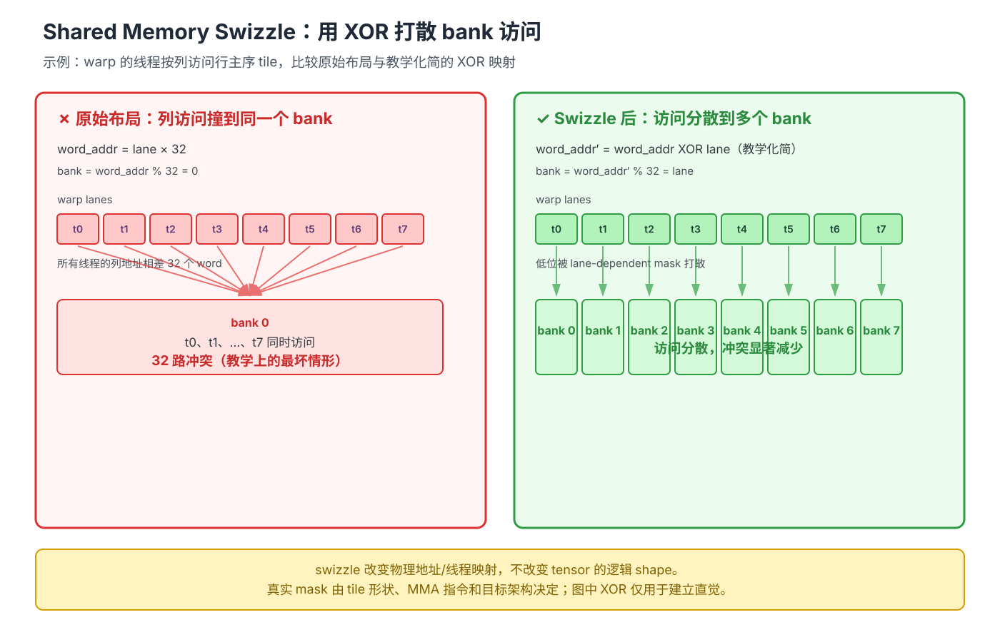

# 第 07 章 高级指令与布局：把 tile 交给硬件高效执行

> **本章目标**：当 GEMM 或 Attention 已经算对，但性能、布局或同步出现问题时，能先判断
> 问题属于哪一层，再选择合适的 TileLang 原语。本章不把 API 当作清单背诵，而是围绕
> 一条主线展开：**逻辑 shape → 物理布局 → block 调度 → 数据时序 → 线程通信**。

**学习信息**

- 难度：高级；预计用时：4–6 小时；
- 前置：第 04～06 章，理解分块 GEMM、软件流水线、共享内存和 fragment；
- 运行范围：以 CUDA 为主，TMA、warpgroup、Tensor Memory 等内容必须结合目标架构和 TileLang 版本；
- 本章产出：一张 bank conflict/swizzle 示意图、一份开关对比实验记录，以及一条高级优化排障路径；
- 参考：[TileLang Instruction Guide](https://github.com/tile-ai/tilelang/blob/main/docs/programming_guides/instructions.md)、
  [TileLang Software Pipeline Guide](https://github.com/tile-ai/tilelang/blob/main/docs/programming_guides/software_pipeline.md)、
  [CUDA Programming Guide](https://docs.nvidia.com/cuda/cuda-c-programming-guide/)。

**阅读顺序：**先读 7.1～7.5，建立「一个 tile 如何被布局、计算和调度」的完整模型；再读
7.6～7.9，理解异步拷贝、同步、warp 原语和原子操作各自解决什么问题；最后读 7.10～7.12，
把这些知识整理成版本检查、实验和排障流程。

## 7.1 先建立四层坐标系

高级 GPU 优化最容易出错的地方，是把几个不同问题都叫作「布局」。先用一个 GEMM 把四层
概念分开。设：

```text
A: [M, K]，B: [K, N]，C: [M, N]                 # 逻辑 tensor shape
A_shared: [BM, BK]，B_shared: [BK, BN]          # 一个 block 读入的 shared tile
C_fragment: [BM, BN]                             # 一个 block 的局部累加器
grid: [ceildiv(N, BN), ceildiv(M, BM)]           # block 的二维坐标
```

| 层次 | 它回答的问题 | 典型 TileLang 对象 | 改变它会影响什么 |
|---|---|---|---|
| 逻辑 shape | 这个数据表示什么？ | `T.Tensor((M, K), dtype)` | 数学结果和索引语义 |
| 物理布局 | 每个元素放在 shared/register 的哪里？哪个线程持有它？ | `T.annotate_layout`、fragment layout | bank conflict、MMA 取数和线程内数据分配 |
| block 调度 | 哪个 block 先执行、相邻执行的 block 访问什么？ | `T.use_swizzle` | L2 局部性和调度顺序 |
| 数据时序 | 数据何时从 global 到 shared，何时可以被消费？ | `T.Pipelined`、`T.async_copy`、`T.tma_copy` | 延迟隐藏、同步和死锁风险 |

先记住一句判断法：**如果逻辑坐标没有变，但元素在片上内存中的物理位置变了，这是布局；
如果 block 的执行顺序变了，这是调度；如果读取和计算重叠了，这是时序。**

### 7.1.1 fragment 的 shape 是逻辑 shape，不是线程清单

例如 `C_fragment` 的逻辑 shape 是 `[BM, BN]`。当 `BM=BN=128`、线程数为 128 时，
总共有 16384 个逻辑元素，但每个线程具体持有哪些元素，并不是由 Python 代码逐一写出来的。
TileLang 会根据 `T.gemm`、`T.copy`、`T.Parallel` 等操作推断一个能共同满足约束的布局。

```python
import tilelang.language as T

BM, BK, BN = 128, 32, 128
dtype = T.float16
accum_dtype = T.float32

# 下面三个 buffer 的逻辑 shape 明确；线程如何持有 fragment 元素由布局推断决定。
A_shared = T.alloc_shared((BM, BK), dtype)             # shape: [BM, BK]
B_shared = T.alloc_shared((BK, BN), dtype)             # shape: [BK, BN]
C_fragment = T.alloc_fragment((BM, BN), accum_dtype)   # shape: [BM, BN]

# T.gemm 根据输入/输出的 scope、shape 和目标后端选择可用的片段映射。
T.clear(C_fragment)
T.gemm(A_shared, B_shared, C_fragment)
```

因此，布局推断不是「编译器把矩阵重新排版」这么简单，而是在回答：

1. 哪些元素由同一个线程处理；
2. 哪些线程组成一个 warp 或 warpgroup；
3. shared 中的地址如何配合 MMA/ldmatrix 等取数方式；
4. 一个操作的输出布局能否作为下一个操作的输入布局。

### 7.1.2 什么时候需要显式布局

先让布局推断工作，只有出现下面情况才考虑 `T.annotate_layout`：

- 编译器报告 layout inference 冲突；
- 生成代码或 profiler 显示 shared-memory bank conflict；
- 目标 MMA/TMA 指令明确要求某种 shared 布局；
- 一个操作的输出布局和下一个操作的输入约束无法自动衔接。

显式布局是约束，不是「打开就更快」的开关。加上它以后必须重新做正确性测试和性能对比。

## 7.2 共享内存 bank conflict：先算 bank，再谈 swizzle

### 7.2.1 bank 是什么

在常见 CUDA 32-bit shared-memory 模型中，可以把一个 word 的 bank 编号近似写成：

```text
bank = word_address % 32                 # 教学模型：一个 word 通常按 4B 理解
```

一个 warp 同时访问 shared memory 时，如果多个线程访问的是**不同地址**，但这些地址映射到
同一个 bank，就会发生 bank conflict，硬件需要分多次服务这些请求。下面是 stride-32 的例子：

```text
thread 0 → word 0  → bank 0
thread 1 → word 32 → bank 0
thread 2 → word 64 → bank 0
...                                      # 不同地址全部撞到 bank 0
```

「32 路冲突约慢 32 倍」只能当作最坏情况的直觉，真实代价还取决于访问宽度、广播行为、
对齐方式、架构和指令路径。**同一个地址被多个线程读取可能触发 broadcast，不等同于不同
地址的冲突。**

### 7.2.2 为什么按列访问行主序 tile 容易冲突

假设一个 shared tile 按行主序存储，每行有 32 个 word：

```text
physical_word(row, col) = row × 32 + col
bank(row, col) = (row × 32 + col) % 32 = col
```

如果一个 warp 的线程固定 `col`、沿 `row` 变化，那么所有线程都会访问同一个 `col` 对应的
bank。逻辑上它们读取的是不同元素，物理上却被迫排队。



图中把 `word_address % 32` 简化成 bank 编号：原始列访问的地址步长为 32 个 word，
所以不同 lane 全部落到 bank 0；右侧用随 lane 变化的 XOR mask 把访问分散到多个 bank。
这只是建立直觉的简化图，不是某个具体 GPU 的完整 MMA 地址公式。可编辑源文件见
[swizzle-bank-conflict.excalidraw](swizzle-bank-conflict.excalidraw)。

### 7.2.3 先判断访问模式，再决定是否需要 swizzle

| 访问现象 | 先检查什么 | 可能的处理 |
|---|---|---|
| 连续 lane 访问连续 global 地址 | coalescing、对齐和向量宽度 | 调整 tile 或 copy 方式 |
| 连续 lane 访问 shared 的同一列 | stride 是否为 32 或其他危险步长 | padding、转置或布局 swizzle |
| 同一个地址被多个 lane 读取 | 是否是广播场景 | 不要把广播误判为 bank conflict |
| GEMM 输入布局不匹配 | `T.gemm` 的输入 scope、shape 和 layout 约束 | 先看编译报错，再显式标注布局 |

不要看到「共享内存」三个字就自动加 swizzle。布局变化会影响 copy、GEMM、归约和边界操作，
错误的布局可能让程序编译失败，甚至在版本/后端特定路径中得到错误结果。

## 7.3 共享内存布局 swizzle：改变物理位置，不改变逻辑坐标

### 7.3.1 它到底改变了什么

共享内存布局 swizzle 可以抽象成：

```text
逻辑坐标 (row, col) ──layout mapping──> 物理 shared 地址
```

改变布局以后，代码仍然使用同一个逻辑坐标 `A_shared[row, col]`，但编译器把它映射到另一
个物理地址，使特定的线程访问模式更少撞 bank。通常有三件事不会变：

- tensor 的逻辑 shape 不变，例如仍是 `[BM, BK]`；
- GEMM 的数学含义不变；
- global 输入和输出的逻辑坐标不变。

变化的是 shared/fragment 内部的线程分配和物理地址映射。

### 7.3.2 TileLang 写法

当前官方示例常见的是 `tilelang.layout.make_swizzled_layout`；较早示例或版本中也可能
出现 `make_mma_swizzle_layout`。两者都应视为**版本相关的布局构造 API**，使用前先查当前
安装版本的官方示例。主线写法如下：

```python
import tilelang
import tilelang.language as T
from tilelang.layout import make_swizzled_layout

BM, BK, BN = 128, 32, 128
dtype = T.float16

# 这两个 shared tile 的逻辑 shape 不变，只附加物理布局约束。
A_shared = T.alloc_shared((BM, BK), dtype)             # shape: [BM, BK]
B_shared = T.alloc_shared((BK, BN), dtype)             # shape: [BK, BN]

# layout swizzle 作用于 shared tile；它不是 block 调度，也不是 global tensor reshape。
T.annotate_layout({
    A_shared: make_swizzled_layout(A_shared),
    B_shared: make_swizzled_layout(B_shared),
})
```

如果当前版本只有旧接口，可以按官方示例替换导入和构造函数：

```python
# 版本兼容提示：旧版本可能使用 cuda.intrinsics 下的名称。
from tilelang.cuda.intrinsics import make_mma_swizzle_layout

# A_shared/B_shared shape 仍分别是 [BM, BK] 和 [BK, BN]，这里只替换布局构造器。
T.annotate_layout({
    A_shared: make_mma_swizzle_layout(A_shared),
    B_shared: make_mma_swizzle_layout(B_shared),
})
```

这里的 XOR 公式只是帮助理解的模型，不能机械地把 `addr ^ lane` 当成通用实现。真实映射
还要匹配 tile 形状、MMA 指令、元素大小、对齐要求和目标架构。

### 7.3.3 swizzle 的验证顺序

1. 先关闭显式布局，确认 baseline 数值正确；
2. 只打开 layout swizzle，使用整除尺寸和非整除尺寸分别验证；
3. 检查生成代码或 profiler，确认访问/指令路径确实发生变化；
4. 固定 warmup、rep、输入 shape、dtype 和线程数，比较中位数或均值；
5. 如果结果变差，记录 bank conflict、寄存器、occupancy 和 shared 使用量，不要只看 TFLOPS。

## 7.4 光栅化 swizzle：改变 block 的执行顺序

共享内存 layout swizzle 解决的是**一个 block 内如何放数据**；`T.use_swizzle` 解决的是
**多个 block 以什么顺序被调度**。它通常通过让相邻执行的 block 访问相邻或重叠的 tile，
改善 L2 cache 局部性。

假设 GEMM 网格为：

```text
grid.x = ceildiv(N, BN)       # bx：输出列 tile
grid.y = ceildiv(M, BM)       # by：输出行 tile
```

默认调度可以近似理解成按行扫描；光栅化 swizzle 会在一个 `panel_size` 范围内重新排列
这些 `(bx, by)`。它不改变 `A_shared`、`B_shared` 的物理布局，也不改变 `C[by, bx]` 的
逻辑结果。

```python
import tilelang.language as T

BM, BN = 128, 128
M, N = 4096, 4096

# 一个 block 负责 C 的一个 [BM, BN] 输出 tile；C 的逻辑 shape 是 [M, N]。
with T.Kernel(T.ceildiv(N, BN), T.ceildiv(M, BM), threads=128) as (bx, by):
    # 这是 block 调度提示，目标是 L2 局部性，不是 shared-memory bank swizzle。
    T.use_swizzle(panel_size=10, enable=True)
```

两种 swizzle 可以同时使用，但实验时必须分开：

| 开关 | 作用范围 | 主要目标 | 常见证据 |
|---|---|---|---|
| `annotate_layout` | block 内的 shared/fragment | 减少 bank conflict、匹配 MMA | shared 访问、布局报错、生成地址 |
| `T.use_swizzle` | block 之间的调度 | 改善 L2 局部性 | L2 命中率、DRAM 流量、kernel 时间 |

如果两个开关一起打开后变快，不能直接说「swizzle 带来收益」，必须分别做 `00、10、01、11`
四组实验。

## 7.5 `T.gemm`：把 tile 计算交给 MMA 路径

### 7.5.1 先用 shape 读懂一次 GEMM

普通矩阵乘的 tile 关系是：

| buffer | 逻辑 shape | 作用 |
|---|---:|---|
| `A_shared` | `[BM, BK]` | 当前 K 分块的左矩阵 |
| `B_shared` | `[BK, BN]` | 当前 K 分块的右矩阵 |
| `C_fragment` | `[BM, BN]` | 沿 K 累加的输出 |

```python
# A_shared shape: [BM, BK]；B_shared shape: [BK, BN]；C_fragment shape: [BM, BN]。
T.clear(C_fragment)                         # 第一个 K tile 前清零累加器
T.gemm(A_shared, B_shared, C_fragment)       # C_fragment += A_shared @ B_shared
```

如果 B 在物理上按 `[BN, BK]` 保存，但数学上希望使用它的转置，可以使用
`transpose_B=True`。FlashAttention 中常见的关系是：

```python
# Q_shared shape: [BM, D]；K_shared shape: [BN, D]；scores shape: [BM, BN]。
# K_shared 的转置后逻辑 shape 是 [D, BN]，因此得到 Q @ K^T。
T.gemm(Q_shared, K_shared, scores, transpose_B=True)
```

这里的关键不是记住参数，而是先写出三者的 shape。shape 不匹配时，优先检查
`transpose_A/B`、输入 scope 和布局，不要马上改线程数。

### 7.5.2 `clear_accum` 和 `policy` 分别解决什么问题

- **累加语义**：第一个 K tile 需要把累加器清零；后续 K tile 要保留之前的部分和。
  在第 06 章的 FlashAttention 中，`acc_o` 也需要跨 tile 保留在线 softmax 的累加结果。
- **`policy`**：它是输出片段如何分给 warp/warpgroup 的调度提示，不改变矩阵乘的数学结果。
  具体支持的 policy、布局约束和底层指令随目标后端变化，必须以当前版本示例和生成源码为准。

`T.gemm` 可能最终使用 `mma`、`wmma`、`wgmma`、CuTe/CUTLASS 或其他后端路径；不能只凭
API 名称断言「它一定用了某条 Tensor Core 指令」。判断依据应是目标架构、生成代码和 profiler。

### 7.5.3 一个最小的 GEMM 片段检查表

读到 `T.gemm(A, B, C)` 时按这个顺序检查：

1. `A/B/C` 的逻辑 shape 是否满足矩阵乘；
2. A/B 是否处于当前 GEMM 支持的 shared/local scope；
3. C 是否是正确 dtype 的 fragment/累加器；
4. 第一次调用是否清零、后续调用是否保留累加；
5. 是否显式指定了不必要的布局，导致约束冲突；
6. 生成源码是否真的走到了预期的 MMA/Tensor Core 路径。

## 7.6 数据搬运：先用 `T.copy`，再考虑显式异步

### 7.6.1 三种搬运语义不要混在一起

| API | 主要用途 | 调用后的默认含义 | 适合什么时候用 |
|---|---|---|---|
| `T.copy` | global/shared/fragment 之间搬运 tile | 同步语义：后续可以安全消费目标 buffer | 默认实现、普通 `T.Pipelined` |
| `T.async_copy` | 手工发起 global→shared 异步拷贝 | 不自动替你 wait；消费前必须显式等待 | 需要精细控制 cp.async pipeline |
| `T.tma_copy` | 目标架构支持时的 TMA/bulk copy | 依赖 barrier/transaction 完成协议 | Hopper/Blackwell 等架构的专用路径 |

`T.copy` 的「同步语义」不等于「编译器只能生成同步 load」。编译器可以根据目标和提示把它
lower 成不同机制，但必须保持「语句完成后目标数据可安全使用」的可观察语义。

### 7.6.2 `T.Pipelined` 是默认的第一步

对于 GEMM 这类规则循环，先使用 `T.Pipelined` 让编译器识别「搬运下一块、计算当前块」的
生产者—消费者关系：

```python
# A shape: [M, K]；B shape: [K, N]；C_fragment shape: [BM, BN]。
# A_shared shape: [BM, BK]；B_shared shape: [BK, BN]。
for ko in T.Pipelined(T.ceildiv(K, BK), num_stages=3):
    T.copy(A[by * BM, ko * BK], A_shared)  # shape: [BM, BK]
    T.copy(B[ko * BK, bx * BN], B_shared)  # shape: [BK, BN]
    T.gemm(A_shared, B_shared, C_fragment)  # shape: [BM, BN]
```

这段代码的教学重点是时序，而不是承诺某种具体指令：第 `ko+1` 块的搬运有机会和第 `ko`
块的计算重叠，但实际流水线深度和生成代码必须验证。

### 7.6.3 手工 `T.async_copy` 的最小结构

只有当自动 pipeline 不够用，或者你需要手动安排异步批次时，才下探到 `T.async_copy`：

```python
# A shape: [M, K]；A_shared shape: [BM, BK]；C_fragment shape: [BM, BN]。
T.async_copy(A[by * BM, ko * BK], A_shared)  # 发起 global -> shared，不代表已经完成

# 这里可以放与 A_shared 无关的计算；示例只保留时序位置。
T.ptx_wait_group(0)                         # 消费 A_shared 前等待异步拷贝完成

# 某些版本/路径还需要显式 shared 可见性同步；以当前 lowering 规则为准。
# T.tvm_storage_sync("shared")
T.gemm(A_shared, B_shared, C_fragment)       # 现在才读取 A_shared
```

这不是可以跨版本直接复制的完整 pipeline。`T.async_copy` 的目标 scope、向量宽度、wait group
和边界处理都可能受后端限制；如果不能 lower 到目标异步路径，有些版本会直接编译失败，而不
会自动退回普通 copy。

## 7.7 同步与等待：两个不同的问题

异步 GPU 代码中至少有两个时间点：

```text
发起拷贝 ──> 拷贝完成 ──> 所有相关线程看见数据 ──> 计算读取 shared
              ↑                  ↑
           wait/group          barrier/sync
```

- **等待（wait）**：异步传输是否已经完成？`T.ptx_wait_group`、TMA 的 transaction/barrier
  协议属于这一类；
- **同步（barrier）**：参与协作的线程是否到达同一个阶段、shared 写入是否对消费者可见？
  `T.sync_threads`、shared-storage sync 属于这一类。

一个 wait 不能自动替代线程间 barrier；一个 barrier 也不能证明 TMA 数据已经到达。普通
`T.Pipelined + T.copy` 的路径可能由 lowering 自动插入必要同步，但手工异步路径必须检查生成代码。

### 7.7.1 常见同步原语

| 原语 | 作用域 | 典型用途 | 约束 |
|---|---|---|---|
| `T.sync_warp()` | 一个 warp/wavefront | warp 内共享状态或阶段同步 | 参与线程必须使用一致的同步语义 |
| `T.sync_threads()` | 一个 block | shared 写完后让整个 block 消费 | 不能只让部分线程走到 barrier |
| `T.sync_grid()` | 协作式 grid | kernel 内跨 block 同步 | 需要 cooperative launch，限制较多 |
| `mbarrier` | 细粒度 transaction/阶段 | TMA、warp specialization | parity、到达计数和 transaction 必须匹配 |

### 7.7.2 TMA 为什么更复杂

TMA 不只是「更快的 `T.copy`」。它通常需要：

1. 创建描述 tensor shape/stride 的 descriptor；
2. 为某次传输声明期望的 transaction 字节数；
3. 发起 global→shared 的 bulk copy；
4. 让 producer 到达 barrier；
5. consumer 等待对应 parity，再读取 shared。

因此，TMA 的核心收益是减少线程搬运和寄存器参与、支持更适合大 tile 的传输方式；核心风险是
descriptor、对齐、barrier phase、shared layout 和目标架构的组合约束。没有 profiler 或生成代码
证据时，不要为了「看起来高级」把普通 `T.copy` 改成 TMA。

## 7.8 warp 原语：在线程之间交换少量数据

### 7.8.1 先分清作用域

| 通信方式 | 覆盖范围 | 是否经过 shared/global | 典型用途 |
|---|---|---|---|
| 普通标量计算 | 当前线程 | 否 | 独立 elementwise |
| shuffle/vote | 当前 warp/wavefront | 否 | 小规模归约、广播、投票 |
| shared + block barrier | 当前 block | 经过 shared | block 内跨 warp 通信 |
| global/atomic | 多个 block | 经过 global | 跨 block 合并或全局计数 |

warp 原语的优势是避免了 shared 往返，但它不能把一个 warp 的数据直接传给另一个 warp。
在 CUDA 中常见 warp 是 32 lane；HIP 的 wavefront 宽度和 mask 语义可能不同，不能直接照搬。

### 7.8.2 `shfl_down` 归约的思路

每个 lane 先有一个标量 `x`，第 0 lane 通过 16、8、4、2、1 五个距离逐步拿到其他 lane 的值：

```python
# x 是每个 lane 的局部标量，不是 tensor；value 仍是一个标量寄存器值。
value = x
for delta in [16, 8, 4, 2, 1]:
    # 从 delta 号更高的 lane 取值；边界 lane 得到的值由 mask/width 规则决定。
    value += T.shfl_down(value, delta)

# 归约结果通常由 lane 0 使用；其他 lane 是否消费它要由算法决定。
```

这是**概念模板**，不是保证跨版本可运行的完整 TileLang kernel。实际使用时要确认当前
版本的 `T.shfl_down` 参数、warp size、active mask 和目标后端实现。

### 7.8.3 vote 原语解决什么问题

- `T.any_sync(pred)`：是否至少一个 lane 满足条件；
- `T.all_sync(pred)`：是否所有参与 lane 满足条件；
- `T.ballot_sync(pred)`：把 lane 的布尔条件压成 bit mask；
- `T.activemask()`：当前活跃 lane 的 mask。

它们适合边界判断、稀疏索引收集和 warp 内快速退出。带 `_sync` 的原语要求参与同步的
线程使用一致的 mask；如果部分线程提前分支退出，必须重新检查 mask 和控制流。

## 7.9 原子操作：处理多个 block 写同一地址

普通写入要求一个地址只有一个明确的写者，或者不同写者写入互不重叠的位置。下面这种 split-K
合并会产生写冲突：多个 block 都计算同一个 `C[i, j]` 的部分和。

```python
# Partial shape: [split_k, M, N]；每个 split block 已经得到一个局部结果。
# C shape: [M, N]；在进入合并阶段前必须先清零。
for i, j in T.Parallel(block_M, block_N):
    gi = by * block_M + i
    gj = bx * block_N + j
    if gi < M and gj < N:
        # acc_fragment shape: [BM, BN]；多个 block 可能同时更新同一个 C[gi, gj]。
        T.atomic_add(C[gi, gj], acc_fragment[i, j])
```

原子操作提供的是「这个地址上的更新不可被其他更新插队」的保证，不会自动解决：

- 输出是否在第一次使用前清零；
- 非原子读写的其他数据依赖；
- block 之间的整体完成顺序；
- 原子热点导致的串行化；
- 目标 dtype 和后端是否支持对应的原子指令。

因此，原子通常是正确性兜底或小规模合并手段，不是默认的性能优化。能通过改变数据分区
让每个 block 写独立地址时，优先消除冲突，再考虑 atomic。

## 7.10 专家级入口：知道它们服务谁就够了

这些 API 适合在基线、布局和流水线都已经验证后再使用：

| 入口 | 服务对象 | 先确认什么 |
|---|---|---|
| `T.dp4a` | int8 四元素点积累加 | 输入打包方式、累加 dtype、目标架构 |
| `T.alloc_tmem` | Blackwell 等目标上的 Tensor Memory | 架构、目标编译路径和容量限制 |
| `T.warpgroup_arrive/commit_batch/wait` | warpgroup MMA/TMA 协作 | producer/consumer 角色和 barrier 协议 |
| `T.set_max_nreg`、`T.inc_max_nreg` | 寄存器上限与 occupancy 权衡 | 生成寄存器数、spill、occupancy |
| `T.annotate_l2_hit_ratio` | cache 行为提示 | 是否有 profiler 证据支持该假设 |

这类 API 高度依赖版本和架构。主线代码应保留清晰的 fallback，并在实验记录中写明：
目标 GPU、TileLang 版本、输入 shape、dtype、是否使用 warp specialization，以及生成源码
中实际出现了什么指令或同步。

## 7.11 一条可执行的高级优化排障路径

不要一次打开 layout swizzle、rasterization、async copy、TMA 和 warp primitive。按下面顺序做：

### 第一步：确认 baseline

- 先用第 05 章或第 06 章已经验证过的 GEMM/Attention；
- 测整除尺寸和非整除尺寸，例如 `M=1003、N=517、K=70`；
- 记录正确性误差、输入 shape、dtype、线程数、warmup、rep 和 kernel 时间。

### 第二步：定位瓶颈属于哪一层

| 现象 | 优先检查 |
|---|---|
| 编译时报 layout mismatch | 输入 scope、shape、transpose、显式布局约束 |
| shared 访问冲突 | 访问 stride、元素大小、padding、layout swizzle |
| L2 命中不理想 | block tile 邻接关系、`T.use_swizzle`、tile 形状 |
| async kernel 结果错误或挂起 | wait group、barrier、phase/parity、越界 copy |
| warp 归约结果随机 | active mask、分支一致性、warp/wavefront 宽度 |
| atomic 版本正确但很慢 | 更新热点、原子粒度、是否能重新分区避免冲突 |

### 第三步：一次只改一个开关

推荐至少做下面四组，而不是只比较「全开」和「全关」：

```text
00：普通 layout + 默认 block 调度
10：只开 shared-memory layout swizzle
01：只开 block rasterization swizzle
11：两个都开
```

如果还要测试异步拷贝，另起一组实验，并保持其他参数完全一致。每一组都要保存正确性结果、
kernel 时间、显存/寄存器变化和 profiler 证据。

### 第四步：查看生成代码，而不是猜指令

TileLang 的 API 是高层描述；「是否真的用了预期的指令」必须通过当前版本提供的源码导出、
lowered IR 或 profiler 确认。下面是一个版本相关的检查骨架：

```python
# kernel 是已经编译的 TileLang kernel；不同版本导出源码的 API 名称可能不同。
source = kernel.get_kernel_source()
print(source[:4000])  # 检查 cp.async、mbarrier、mma/wgmma 等实际路径
```

## 7.12 本章小结

- **布局推断**解决「每个线程/warp 持有哪些逻辑元素」；fragment 的 shape 不等于线程清单。
- **bank conflict** 是不同地址映射到同一 shared-memory bank；先根据 stride 算 bank，再决定是否 swizzle。
- **共享内存 layout swizzle** 改变 block 内的物理地址/线程映射；`T.use_swizzle` 改变 block 之间的调度顺序；两者不是同一个开关。
- **`T.gemm`** 是 tile 级矩阵乘入口；先用 shape、scope、transpose 和累加语义检查，再判断底层指令。
- **`T.copy`** 是默认同步语义；`T.async_copy` 和 `T.tma_copy` 暴露更细的时序控制，必须分别处理 wait、barrier 和版本/架构约束。
- **warp 原语**解决一个 warp 内的少量通信；**atomic** 解决多个 block 对同一地址的并发更新，但可能引入热点。
- 高级优化的证据链是：**baseline → 一次改一个开关 → 正确性 → profiler/生成代码 → 性能结论**。

## 7.13 Checkpoint

1. 对一个行主序、每行 32 个 word 的 shared tile，写出固定列、线程沿行访问时的 bank 公式；
2. 解释 `annotate_layout` 和 `T.use_swizzle` 分别改变哪一层，并设计 `00/10/01/11` 四组实验；
3. 给出 `A_shared=[BM,BK]、B_shared=[BK,BN]、C_fragment=[BM,BN]` 时的 `T.gemm` shape 关系，
   再解释 `transpose_B=True` 何时有用；
4. 画出 `T.async_copy → wait → shared barrier → T.gemm` 的时序，并说明 wait 和 barrier 为什么不能互相替代；
5. 用 `shfl_down` 写出 32-lane 求和需要的 5 个 delta，并说明它为什么只能在 warp 内工作；
6. 构造一个 split-K 的 atomic 合并例子，说明输出清零、热点和 fallback；
7. 用一个非整除尺寸完成一次高级开关实验，提交：正确性结果、基线/变体时间、目标环境、生成代码或 profiler 证据。

## 口述自测（详答见第 10 章）

1. **为什么 fragment 的 shape 不能直接告诉你每个线程持有哪些元素？**（布局推断决定线程内分配）。
2. **bank conflict 与 coalesced access 有什么区别？**（前者关注 shared bank，后者主要关注 global transaction）。
3. **layout swizzle 与 rasterization swizzle 的区别？**（一个改 block 内物理布局，一个改 block 调度顺序）。
4. **为什么 `T.copy` 可以作为默认搬运原语？**（它保证同步可观察语义，具体 lower 机制交给编译器）。
5. **`T.async_copy` 之后为什么还要 wait？**（发起拷贝不等于目标 shared 已经完成）。
6. **为什么 wait 不能替代 `sync_threads`？**（wait 管数据传输完成，barrier 管线程到达和可见性）。
7. **`shfl_down` 能否完成整个 block 的归约？**（不能直接跨 warp，需要 shared、分层归约或其他 block 级机制）。
8. **atomic 一定比普通写入更安全吗？**（只保证特定地址上的原子更新，不能替代清零、边界和整体同步）。
9. **如何证明某个高级优化真的生效？**（固定实验条件，先验证正确性，再用生成代码和 profiler 给证据）。
